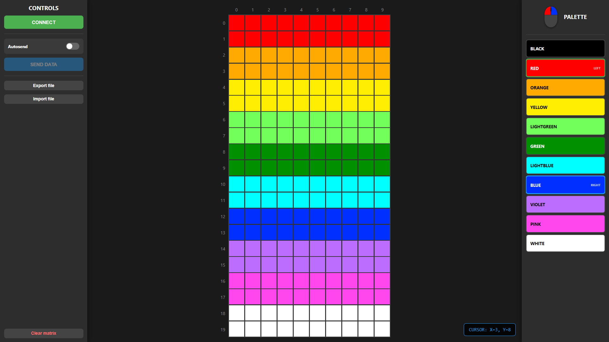
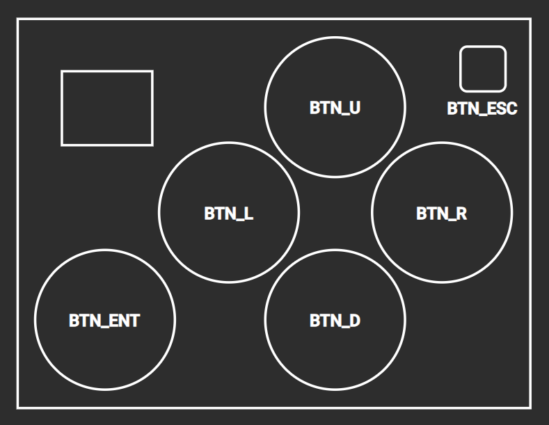
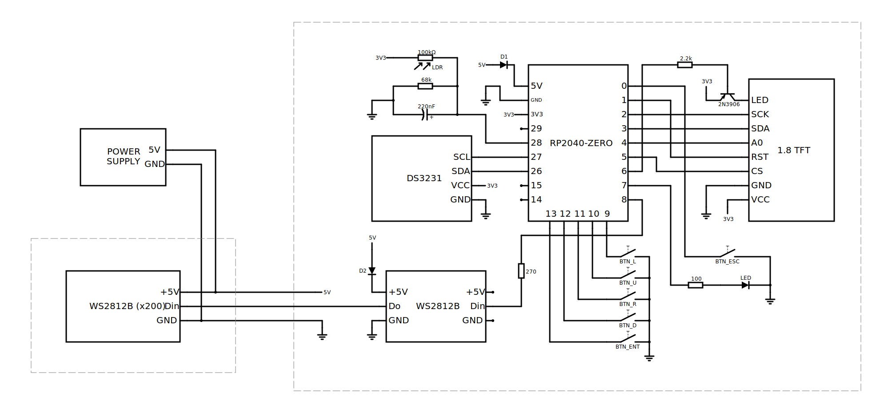

# Spis treści
- [O projekcie](#o-projekcie)
    - [Obsługa i działanie konsoli](#obsługa-i-działanie-konsoli)
- [Symulator](#symulator)
    - [Instalacja i konfiguracja w systemie Windows](#instalacja-i-konfiguracja-w-systemie-windows-testowane-na-windows-11)
    - [Instalacja i konfiguracja w systemie Linux](#instalacja-i-konfiguracja-w-systemie-linux-testowane-na-ubuntu-240404-lts)
    - [Kompatybilność z projektem w Arduino IDE](#kompatybilność-z-projektem-w-arduino-ide)
- [Narzędzie do rysowania](#narzędzie-do-rysowania)
- [Synchronizacja i zarządzanie kodem z wykorzystaniem platformy GitHub](#synchronizacja-i-zarządzanie-kodem-z-wykorzystaniem-platformy-github)
- [Programowanie konsoli w Arduino IDE](#programowanie-konsoli-w-arduino-ide)
    - [Instalacja i konfiguracja środowiska](#instalacja-i-konfiguracja-środowiska)
    - [Programowanie mikrokontrolera](#programowanie-mikrokontrolera)
    - [Struktura plików](#struktura-plików)
    - [Tworzenie i dodawanie własnej gry](#tworzenie-i-dodawanie-własnej-gry)
- [Dokumentacja kodu](#dokumentacja-kodu)
    - [Obsługa głównego wyświetlacza matrycowego](#obsługa-głównego-wyświetlacza-matrycowego)
    - [Obsługa przycisków](#obsługa-przycisków)
    - [Obsługa wyświetlacza TFT](#obsługa-wyświetlacza-tft)
    - [Obsługa systemu plików](#obsługa-systemu-plików)
- [Dokumentacja hardware'u](#dokumentacja-hardwareu)
    - [Lista głównych części](#lista-głównych-części)
    - [Schemat elektryczny](#schemat-elektryczny)
    - [Zasilanie](#zasilanie)
    - [Zdjęcia](#zdjęcia)
- [Uwagi, wskazówki i rozwiązywanie problemów](#uwagi-wskazówki-i-rozwiązywanie-problemów)

<br>

# O projekcie

To repozytorium dotyczy konsoli do gier stworzonej w ramach Technicznego Koła Naukowego na UMK w Toruniu.

Założeniem projektu jest możliwość napisania własnych gier przez studentów w języku C++. Gry można testować w dedykowanym [symulatorze](#symulator), a następnie (samodzielnie lub z pomocą opiekuna projektu - przewodniczącego TKN) zaprogramować na fizycznej konsoli w wykorzystaniem środowiska Arduino IDE. 

## Obsługa i działanie konsoli

Urządzenie składa się z dwóch komponentów: **głównego wyświetlacza** (matrycy LED), na którym wyświetlane są gry, oraz **jednostki centralnej/sterującej**, w której skład wchodzą m.in. układ z mikrokontrolerem, przyciski, a także mniejszy pomocniczy wyświetlacz.

Konsola po określonym czasie przechodzi w tryb czuwania, w którym wyłącza pomocniczy wyświetlacz. Wciśnięcie dowolnego przycisku wybudza urządzenie.

Z poziomu menu głównego **SELECT GAME** można uruchomić wybraną grę - do poruszania się po menu należy skorzystać z **przycisków kierunkowych** (lewo, prawo, góra, dół) oraz **przycisku ENTER** (w lewej, dolnej części urządzenia). Z gry wychodzi się poprzez przytrzmanie przez co najmniej 1,5 s **przycisku ESC**. Gra zamykana jest także automatycznie - w przypadku braku aktywności przez dłuższy czas.

Konsola pokazuje na głównym wyświetlaczu zegar z aktualną godziną, gdy żadna gra nie jest uruchomiona. Jasność wyświetlacza w tym trybie dostosowuje się do jasności otoczenia.

Aby wejść do ukrytego menu ustawień **SETTINGS** należy wcisnąć (będąc na ekranie **SELECT GAME**) kombinację przycisków **GÓRA** + **LEWO** + **DÓŁ** + **ESC**. Można w nim wybrać jedną z pozycji:
- **CLOCK** - ustawienie bieżącej godziny
- **GAME AUTO EXIT** - ustawianie czasu automatycznego zamknięcia gry z powodu nieaktywności
- **LCD SCREEN SAVER** - ustawianie czasu uśpienia wyświetlacza pomocniczego
- **SERIAL DRAW MODE** - uruchomienie [narzędzia do rysowania](#narzędzie-do-rysowania)

# Symulator 

Gry na konsolę testować można w dedykowanym symulatorze (zaimplementowana obsługa wyświetlacza matrycowego oraz przycisków). Obsługiwany jest w systemach operacyjnych Windows oraz Linux.


## Instalacja i konfiguracja w systemie Windows (testowane na Windows 11)

### Pobierz i zainstaluj kompilator `g++` oraz narzędzie `make`

Najłatwiej jest do tego użyć programu [MSYS2](https://www.msys2.org/). Po instalacji z domyślnymi parametrami, pobierz wymagane pakiety, wpisując w konsoli MSYS2 UCRT64:
```
pacman -S mingw-w64-ucrt-x86_64-gcc
```
a następnie:
```
pacman -S make
```

Zaktualizuj zmienną środowiskową PATH o ścieżki do wymaganych programów zgodnie z instrukcją:

**WIN+R > SystemPropertiesAdvanced.exe > Zmienne środowiskowe > Path > Edytuj > Nowy**

Wpisz: `C:\msys64\usr\bin` oraz `C:\msys64\ucrt64\bin`


Na koniec zweryfikuj poprawne działanie narzędzi, wpisując w systemowym wierszu polecenia (CMD):

```
g++ --version
```
```
make --version
```


### Kompilacja i uruchomienie gry

Skopiuj folder **simulator** na swój komputer. Otwórz wiersz polecenia w tej lokalizacji (najprościej poprzez wpisanie `cmd` w pasku adresu eksploratora plików). Wpisz polecenie `make`, aby skompilować program, lub `make run`, aby skompilować i uruchomić aplikację symulatora.


## Instalacja i konfiguracja w systemie Linux (testowane na Ubuntu 24.04.04 LTS)

Zainstaluj potrzebne narzędzia i biblioteki graficzne:
```
sudo apt install g++ make libgl1-mesa-dev libx11-dev
```

Aplikację symulatora kompiluj poleceniem `make` (lub `make run`, aby automatycznie uruchomić) z poziomu katalogu **simulator**.


## Kompatybilność z projektem w Arduino IDE

Symulator zapewnia pełną kompatybilność ze wszystkimi wypisanymi metodami dotyczącymi obsługi [wyświetlacza matrycowego](#obsługa-głównego-wyświetlacza-matrycowego-10x20) oraz [przycisków](#obsługa-przycisków), a także z funkcją `millis()`, która zwraca liczbę milisekund od uruchomienia programu. Przyciski na klawiaturze zmapowane są w następujący sposób:

- Strzałka w lewo **-** `BTN_L`<br>
- Strzałka w prawo **-** `BTN_R`<br>
- Strzałka w górę **-** `BTN_U`<br>
- Strzałka w dół **-** `BTN_D`<br>
- Enter **-** `BTN_ENT`<br>
- Backspace **-** `BTN_ESC`<br>

Symulowaną grę najlepiej umieszczać w klasie `SimGame` - symulator obsługuje jedną grę, tworząc obiekt tej klasy.

Szablon pliku `SimGame.h`:
```cpp
#ifndef SIMGAME_H
#define SIMGAME_H

#include "Engine.h"

extern InputManager keys;
extern FakeFastLED FastLED;

class SimGame : public Game {
private:

public:
  void setup() override;
  void loop() override;
};

#endif
```

Szablon pliku `SimGame.cpp`:
```cpp
#include "SimGame.h"

void SimGame::setup() {

}

void SimGame::loop() {
  
}
```

# Narzędzie do rysowania

Strona [drawingTool.html](drawingTool.html) pozwala na rysowanie po wirtualnym wyświetlaczu, który może być dodatkowo synchronizowany w czasie rzeczywistym z fizycznym wyświetlaczem konsoli. W tym celu należy podłączyć urządzenie do komputera za pomocą kabla USB, z menu ustawień konsoli (kombinacja klawiszy **U** + **L** + **D** + **ESC** w menu wyboru gry) wybrać pozycję **SERIAL DRAW MODE** i nawiązać połączenie za pomocą przycisku **CONNECT** widocznym na stronie narzędzia.

Rysowanie odbywa się za pomocą lewego oraz prawego przycisku myszy. Kolor przypisany do konkretnego przycisku można zmienić, klikając jedno z pól wyboru w palecie kolorów. Stan wirtualnego wyświetlacza można zapisywać i wczytywać, operując na plikach (przyciski **Export file** oraz **Import file**).



# Synchronizacja i zarządzanie kodem z wykorzystaniem platformy GitHub

Współpraca nad kodem gier opiera się na klonowaniu wspólnego repozytorium oraz wykorzystaniu systemu Git do aktualizacji plików na platformie GitHub. W tym celu należy zwrócić się z prośbą o nadanie uprawnień do modyfikacji repozytorium do **przewodniczącego TKN**.

Najłatwiej jest wykorzystać w tym celu aplikację [GitHub Desktop](https://desktop.github.com/download/). Należy w niej zalogować się na swoje konto i [sklonować](https://docs.github.com/en/desktop/adding-and-cloning-repositories/cloning-a-repository-from-github-to-github-desktop) to repozytorium do wybranej przez siebie lokalizacji. Pobieranie zmian odbywa się za pomocą funkcji [Pull origin](https://docs.github.com/en/desktop/working-with-your-remote-repository-on-github-or-github-enterprise/syncing-your-branch-in-github-desktop#pulling-to-your-local-branch-from-the-remote), co należy wykonywać każdorazowo przed przystąpieniem do wprowadzania zmian w kodzie. Prace nad projektem w środowisku Arduino IDE należy wykonywać na sklonowanym lokalnym repozytorium, po czym aktualizować swoje zmiany przy pomocy [Commit i Push origin](https://docs.github.com/en/desktop/making-changes-in-a-branch/committing-and-reviewing-changes-to-your-project-in-github-desktop#write-a-commit-message-and-push-your-changes). Dla ułatwienia procesu wszystko możesz realizować w głównej gałęzi **main**.

**Uwaga!**<br>
Synchronizowane jest **całe** repozytorium, więc korzystać z pozostałych narzędzi (**w tym symulatora!**) należy po uprzednim skopiowaniu wybranego folderu/pliku w inną lokalizację na komputerze.

# Programowanie konsoli w Arduino IDE

### Uwaga!

**Przed rozpoczęciem pracy nad projektem zapoznaj się z rozdziałem [Synchronizacja i zarządzanie kodem z wykorzystaniem platformy GitHub](#synchronizacja-i-zarządzanie-kodem-z-wykorzystaniem-platformy-github).**

## Instalacja i konfiguracja środowiska

Pobierz i zainstaluj środowisko [Arduino IDE](https://www.arduino.cc/en/software/), a następnie w **File > Preferences > Additional boards manager URLs** dodaj pakiet:
```
https://github.com/earlephilhower/arduino-pico/releases/download/global/package_rp2040_index.json
```


Zainstaluj płytki **Raspberry Pi Pico/RP2040/RP2350** z panelu **BOARDS MANAGER**.


Zainstaluj poniższe biblioteki z panelu **LIBRARY MANAGER** wraz ze wszystkimi zależnościami (w przypadku pojawienia się komunikatu **Install library dependencies** kliknij **INSTALL ALL**):

`FastLED` by *Daniel Garcia*<br>
`RTClib` by *Adafruit*<br>
`Adafruit ST7735 and ST7789 Library` by *Adafruit*


## Programowanie mikrokontrolera

Otwórz projekt **TKN_Console** w środowisku Arduino IDE, a następnie z menu **Tools** wybierz następujące ustawienia:

Board: **Waveshare RP2040 Zero**<br>
Flash Size: **2MB (Sketch: 1792KB, FS: 256KB)**<br>
CPU Speed: **125 MHz**.

Na tym etapie możliwa jest już kompilacja programu (przycisk **Verify**).

Po podłączeniu kablem USB-C do mikrokontrolera wybierz odpowiedni dostępny **Port** i skompiluj oraz wgraj program za pomocą przycisku **Upload**.


## Struktura plików

Projekt składa się z plików:

- ### `TKN_Console.ino`:

    Obsługuje konfigurację, przełączanie i pętle główne gier, tworzy obiekty globalne, inicjuje moduły. Zawiera funkcje `void setup()` i `void loop()` oraz (dla drugiego rdzenia mikroprocesora - do obsługi przycisków) funkcje `void setup1()` i `void loop1()`.

- ### `Engine.h`:

    Plik nagłówkowy "silnika" konsoli. Zawiera m.in. definicje wyprowadzeń, dołączenia zewnętrznych bibliotek, definicje nazw kolorów i przycisków, definicje klas:

    `InputManager` - do zarządzania przyciskami (debouncing, zapamiętywanie stanów)<br>
    `Game` - bazowa klasa dla gier<br>
    `FileManager` - do zapisu danych w pamięci FLASH (konfiguracja, wyniki w grach, itp.)

- ### `Engine.cpp`:

    Zawiera implementację metod z w.w. klas.

- ### `GameRegistry.h`

    Stanowi rejestr gier, zawierający: nazwy ich klas, dołączenia plików nagłówkowych gier, a także tytuły wyświetlane w menu wyboru gry.

- ### `Menu.h`:

    Plik nagłówkowy głównego menu konsoli (wybór gier, konfiguracja parametrów użytkownika, uruchomienie trybu rysowania, itd.), które jest pochodną klasy `Game`. Z poziomu Menu "zlecane" jest przełączenie gry wybranej przez użytkownika.

- ### `Menu.cpp`:

    Implementacja metod z menu konsoli.

#### Gry zawarte są w plikach `NazwaGry.h` oraz `NazwaGry.cpp`

## Tworzenie i dodawanie własnej gry

Aby utworzyć pustą grę o nazwie **TestGame**, wyświetlanej w menu konsoli jako **TEST GAME**:

1. Utwórz plik `TestGame.h`:
    ```cpp
    #ifndef TESTGAME_H
    #define TESTGAME_H

    #include "Engine.h"

    extern Adafruit_ST7735 tft;
    extern InputManager keys;
    extern FileManager file;

    class TestGame : public Game {
    private:

    public:
    void setup() override;
    void loop() override;
    };

    #endif
    ```

2. Utwórz plik `TestGame.cpp`:
    ```cpp
    #include "TestGame.h"

    void TestGame::setup() {

    }

    void TestGame::loop() {
    
    }
    ```

2. W pliku `GameRegistry.h`:

    Dołącz plik nagłówkowy swojej gry dyrektywą:
    ```cpp
    #include "TestGame.h"
    ```

    Dodaj grę do menu w tablicy `const GameEntry GAMES_LIST[]` makrem:
    ```cpp
    ADDGAME(TestGame, "TEST GAME")
    ```

Gotowe! Twoja gra powinna pojawić się w menu konsoli po wgraniu programu.

# Dokumentacja kodu

## Obsługa głównego wyświetlacza matrycowego

- ### `void setPixel(uint8_t x, uint8_t y, Color color)`

    Ustawia piksel o współrzędnych `x` (0 - 9) i `y` (0 - 19) na kolor `color`:
    - `BLACK`
    - `RED`
    - `ORANGE`
    - `YELLOW`
    - `LIGHTGREEN`
    - `GREEN`
    - `LIGHTBLUE`
    - `BLUE`
    - `VIOLET`
    - `PINK`
    - `WHITE`
    
    Funkcja ta stosuje korekcję kolorów dla poszczególnych pasków LED.

    **Uwaga! Aby zaktualizować wyświetlacz należy wywołać metodę `FastLED.show()`**


- ### `FastLED.show()`

    Metoda z biblioteki **FastLED** do aktualizacji wyświetlacza. Dla najlepszych efektów należy używać jej **jednokrotnie** i **tylko** w przypadku zmian pikseli na matrycy.

- ### `FastLED.clear()`

    Metoda z biblioteki **FastLED** do czyszczenia całego wyświetlacza. Zmiany będą widoczne po wywołaniu metody `FastLED.show()`.

### Użycie pozostałych metod z biblioteki FastLED **nie jest  zalecane**.

## Obsługa przycisków

Zdefiniowane nazwy przycisków `Button`:
- `BTN_L` - lewo (**L**)
- `BTN_R` - prawo (**R**)
- `BTN_U` - góra (**U**)
- `BTN_D` - dół (**D**)
- `BTN_ENT` - enter/zatwierdź (**ENT**)
- `BTN_ESC` - escape/powrót (**ESC**)



### Do obsługi przycisków należy skorzystać z globalnego obiektu `keys` klasy `InputManager`. Zaimplementowany jest debouncing oraz mechanizm zapamiętywania stanów.

- ### `bool keys.wasPressed(Button b)`

    Metoda ta sprawdza, czy dany przycisk został wciśnięty, a następnie automatycznie resetuje jego flagę stanu. Oznacza to, że po wciśnięciu przycisku metoda `wasPressed()` **jednorazowo** zwróci `true`.

- ### `bool keys.wasReleased(Button b)`

    Działa podobnie jak `wasPressed()`, lecz wykrywa puszczenie przycisku.

- ### `bool keys.isDown(Button b)`

    Odczytuje aktualny stan przycisku (wciśnięty - zwraca `true`).

- ### `bool keys.clear()`

    Czyści flagi stanów wciśnięcia i puszczenia dla wszystkich przycisków.

<br>

**Uwaga!**<br>
Możliwa jest obsługa przycisku `BTN_ESC`, jednak należy pamiętać, że jego przytrzymanie przez 1,5 s powoduje zamknięcie gry - logika ta zaimplementowana jest na poziomie programu głównego.

## Obsługa wyświetlacza TFT

Wyświetlacz jest już skonfigurowany (przez program główny) i gotowy do użycia pod obiektem `tft`. Metody i stałe przydatne do jego obsługi można poznać analizując kod innych gier (w tym menu konsoli) lub też bezpośrednio w dokumentacji bibliotek [**Adafruit GFX**](https://cdn-learn.adafruit.com/downloads/pdf/adafruit-gfx-graphics-library.pdf) i [**Adafruit ST7735**](https://github.com/adafruit/Adafruit-ST7735-Library).

Dostępna jest jedna dodatkowa funkcja globalna z pliku `Engine.h`:

- `void printCentered(const char* text, uint8_t yPos, uint8_t fontSize)`

    Pozwala ona na wypisanie na ekranie wyśrodkowanego horyzontalnie tekstu `text` na wysokości `yPos` o rozmiarze `fontSize`.

## Obsługa systemu plików

Dane (np. tablicę wyników w grze) można zapisywać w pamięci nieulotnej (FLASH) jako pliki. Dane te najlepiej przechowywać w dowolnej strukturze:

```cpp
struct ExampleStructure {
  uint32_t ExampleArray1[4];
  uint16_t ExampleVariable1;
  uint16_t ExampleVariable2;
};

ExampleStructure exampleData;
```

a następnie przy pomocy metod obiektu `file` z klasy `FileManager` zapisywać i odczytywać z pliku:

- ### `void file.saveData("TestGameData", &exampleData, sizeof(exampleData))`

    Pozwala zapisać dane ze zmiennej `exampleData` typu `ExampleStructure` do pliku o nazwie `TestGameData`.

- ### `bool file.loadData("TestGameData", &exampleData, sizeof(exampleData))`

    Pozwala wczytać dane z pliku o nazwie `TestGameData` do zmiennej `exampleData` typu `ExampleStructure`. Zwraca `false` jeśli plik nie istnieje.

### W nazwie pliku powinno użyć się nazwy gry w celu uniknięcia konfliktu z plikami innych gier.

# Dokumentacja hardware'u

## Lista głównych części

- płytka z mikrokontrolerem [RP2040-Zero](https://www.waveshare.com/wiki/RP2040-Zero)
- wyświetlacz LCD [1,8" TFT 128x160px](https://www.lcdwiki.com/1.8inch_SPI_Module_ST7735S_SKU:MSP1803)
- moduł RTC [DS3231 AT24C32 I²C](https://manuals.plus/asin/B07Q7NZTQS)
- diody adresowalne [WS2812B](https://cdn-shop.adafruit.com/datasheets/WS2812B.pdf) (201 szt.)
- przyciski Arcade (5 szt.)
- fotorezystor

## Schemat elektryczny



## Zasilanie

Konsola zasilana jest zasilaczem sieciowym **DC 5.0V 2.0A**, który podaje napięcie na matrycę LED oraz resztę elektroniki. Możliwe jest **jednoczesne** zasilanie konsoli poprzez kabel USB-C podpięty do mikrokontrolera (dzięki diodzie **D1**) - wtedy matryca pobiera energię z zasilacza, a pozostała elektronika z gniazda USB (<100 mA). Zasilenie **tylko** przez USB również jest dopuszczalne, choć matryca LED nie będzie wtedy aktywna.

## Zdjęcia

[Zdjęcia konsoli](./docs/images)

# Uwagi, wskazówki i rozwiązywanie problemów

- Nie należy zmieniać **domyślnej jasności wyświetlacza**, ustawionej metodą `FastLED.setBrightness()`. Została ona wyliczona na podstawie wydajności prądowej zasilacza i maksymalnego poboru prądu przez konsolę, a jej modyfikacja może doprowadzić do **uszkodzenia** któregoś z elementów.
- Kod należy pisać **nieblokująco**, czyli przede wszystkim nie stosować pętli oczekujących na jakieś zdarzenie oraz funkcji `delay()` - zamiast tego warto wykorzystywać zależności czasowe oparte o funkcję `millis()` i tworzyć program w konwencji **maszyny stanów**.
- W przypadku **problemów z zaprogramowaniem** mikrokontrolera (np. błędy systemowe USB, niepowodzenie wgrywania programu) należy wejść w tryb **BOOTSEL**: przytrzymać na płytce przycisk **BOOT** i zrestartować mikrokontroler przyciskiem **RESET**. Mikrokontroler w takim trybie powinien być widoczny w eksploratorze plików jako dysk o nazwie **RPI-RP2**. W Arduino IDE należy wtedy wybrać **Tools > Port > UF2 Board**.