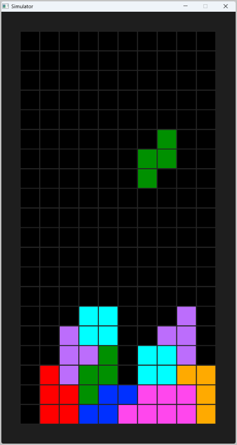
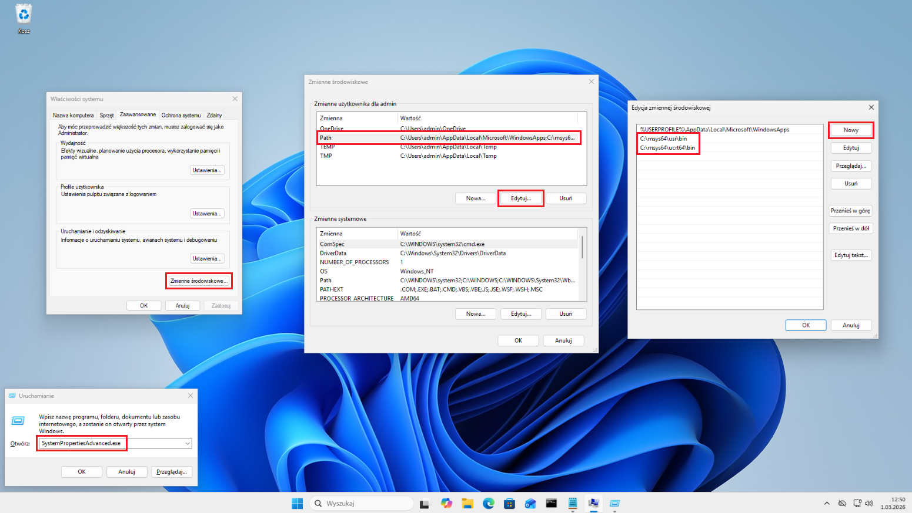
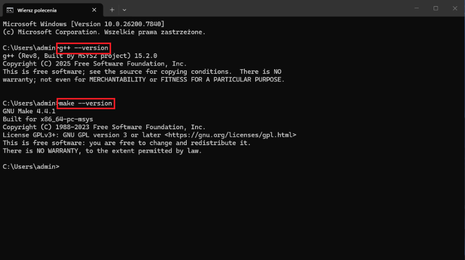
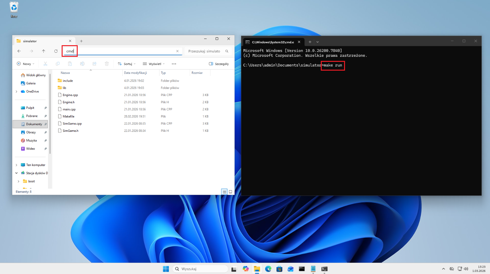
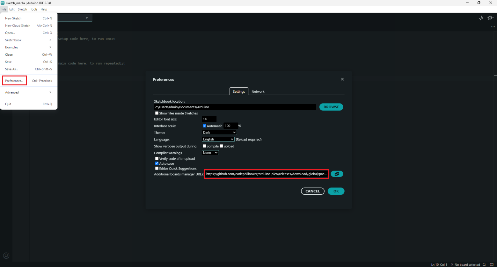
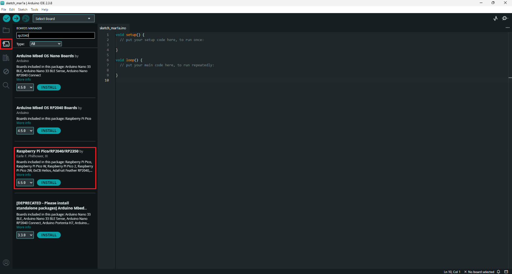
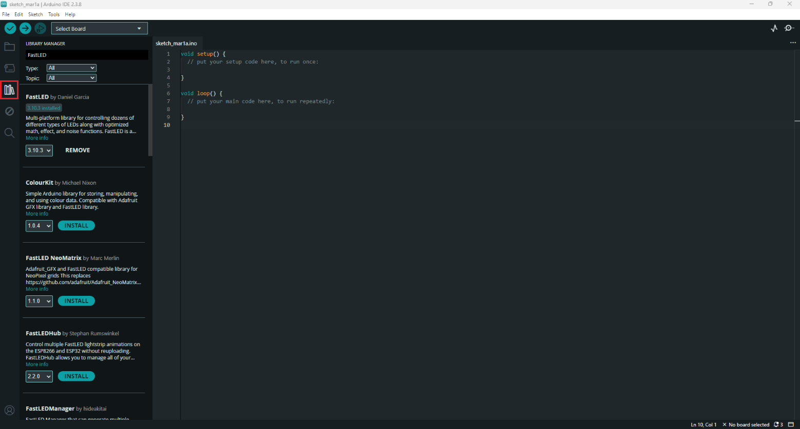
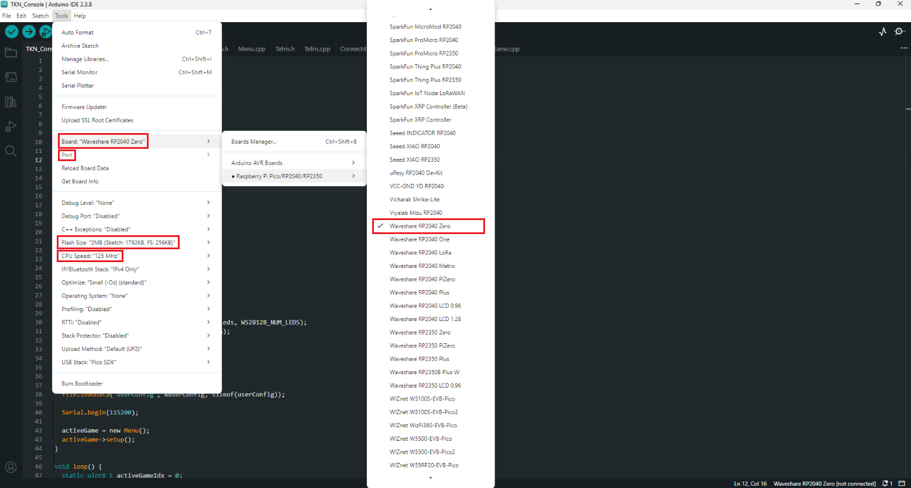
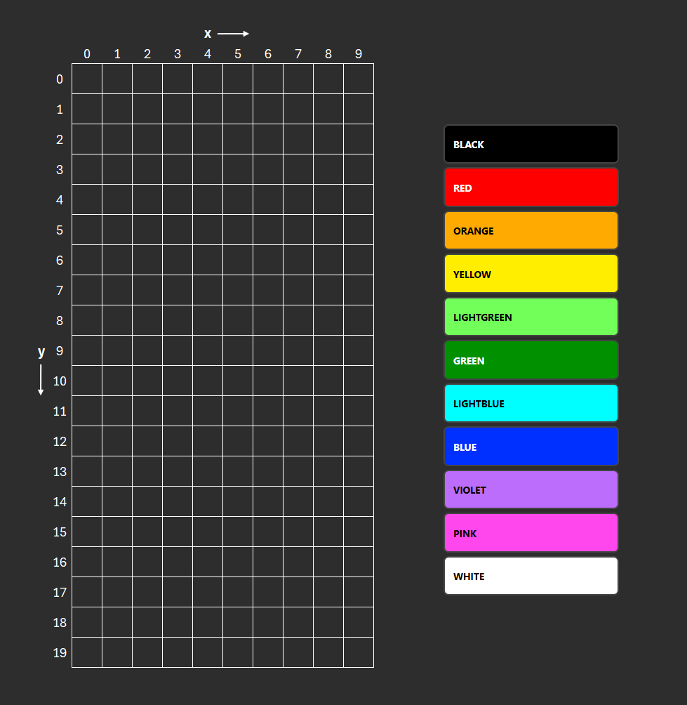

# O projekcie
Lorem ipsum

# Spis treści
- [Symulator](#symulator)
- [Programowanie konsoli w Arduino IDE](#programowanie-konsoli-w-arduino-ide)
- [Struktura projektu](#struktura-projektu)
- [Dokumentacja kodu](#dokumentacja-kodu)

# Symulator 

Gry na konsolę testować można w dedykowanym symulatorze (zaimplementowana obsługa wyświetlacza matrycowego oraz przycisków). Obsługiwany jest w systemach operacyjnych Windows oraz Linux.



## Instalacja i konfiguracja w systemie Windows (testowane na Windows 11)

### Pobierz i zainstaluj kompilator `g++` oraz narzędzie `make`

Najłatwiej jest do tego użyć programu [MSYS2](https://www.msys2.org/). Po instalacji z domyślnymi parametrami, pobierz wymagane pakiety, wpisując w konsoli MSYS2 UCRT64:
```
pacman -S mingw-w64-ucrt-x86_64-gcc
```
a następnie:
```
pacman -S make
```

Zaktualizuj zmienną środowiskową PATH o ścieżki do wymaganych programów zgodnie z instrukcją:

**WIN+R > SystemPropertiesAdvanced.exe > Zmienne środowiskowe > Path > Edytuj > Nowy**

Wpisz: `C:\msys64\usr\bin` oraz `C:\msys64\ucrt64\bin`



Na koniec zweryfikuj poprawne działanie narzędzi, wpisując w systemowym wierszu polecenia (CMD):

```
g++ --version
```
```
make --version
```


### Kompilacja i uruchomienie gry

Skopiuj folder **simulator** na swój komputer. Otwórz wiersz polecenia w tej lokalizacji (najprościej poprzez wpisanie `cmd` w pasku adresu eksploratora plików). Wpisz polecenie `make`, aby skompilować program, lub `make run`, aby skompilować i uruchomić aplikację symulatora.



## Instalacja i konfiguracja w systemie Linux (testowane na Ubuntu 24.04.04 LTS)

Zainstaluj potrzebne narzędzia i biblioteki graficzne:
```
sudo apt install g++ make libgl1-mesa-dev libx11-dev
```

Aplikację symulatora kompiluj poleceniem `make` (lub `make run`, aby automatycznie uruchomić) z poziomu katalogu **simulator**.


## TODO kompatybilność

[opisać funkcje]

# Programowanie konsoli w Arduino IDE

## Instalacja i konfiguracja środowiska

Pobierz i zainstaluj środowisko [Arduino IDE](https://www.arduino.cc/en/software/), a następnie w **File > Preferences > Additional boards manager URLs** dodaj pakiet:
```
https://github.com/earlephilhower/arduino-pico/releases/download/global/package_rp2040_index.json
```


Zainstaluj płytki **Raspberry Pi Pico/RP2040/RP2350** z panelu **BOARDS MANAGER**.



Zainstaluj poniższe biblioteki z panelu **LIBRARY MANAGER** wraz ze wszystkimi zależnościami (w przypadku pojawienia się komunikatu **Install library dependencies** kliknij **INSTALL ALL**):

`FastLED` by *Daniel Garcia*<br>
`RTClib` by *Adafruit*<br>
`Adafruit ST7735 and ST7789 Library` by *Adafruit*




## Programowanie mikrokontrolera

Otwórz pobrany projekt **TKN_Console** w środowisku Arduino IDE, a następnie z menu **Tools** wybierz płytkę **Waveshare RP2040 Zero**, konfigurację pamięci **Flash Size: 2MB (Sketch: 1792KB, FS: 256KB)** oraz taktowanie procesora **CPU Speed: 125 MHz**. Na tym etapie możliwa jest już kompilacja programu (przycisk **Verify**),

Po podłączeniu kablem USB-C do mikrokontrolera wybierz odpowiedni dostępny **Port** i skompiluj oraz wgraj program za pomocą przycisku **Upload**.




# Struktura projektu

## Struktura plików

Projekt składa się z plików:

### `TKN_Console.ino`:

Obsługuje konfigurację, przełączanie i pętle główne gier, tworzy obiekty globalne, inicjuje moduły. Zawiera funkcje `void setup()` i `void loop()` oraz (dla drugiego rdzenia mikroprocesora - do obsługi przycisków) funkcje `void setup1()` i `void loop1()`.

### `Engine.h`:

Plik nagłówkowy "silnika" konsoli. Zawiera m.in. definicje wyprowadzeń, dołączenia zewnętrznych bibliotek, definicje nazw kolorów i przycisków, definicje klas:

`InputManager` - do zarządzania przyciskami (debouncing, zapamiętywanie stanów)<br>
`Game` - bazowa klasa dla gier<br>
`FileManager` - do zapisu danych w pamięci FLASH (konfiguracja, wyniki w grach, itp.)

### `Engine.cpp`:

Zawiera implementację metod z w.w. klas.

### `GameRegistry.h`

Stanowi rejestr gier, zawierający: nazwy ich klas, dołączenia plików nagłówkowych gier, a także tytuły wyświetlane w menu wyboru gry.

### `Menu.h`:

Plik nagłówkowy głównego menu konsoli (wybór gier, konfiguracja parametrów użytkownika, uruchomienie trybu rysowania, itd.), które jest pochodną klasy `Game`. Z poziomu Menu "zlecane" jest przełączenie gry wybranej przez użytkownika.

### `Menu.cpp`:

Implementacja metod z menu konsoli.

#### Gry zawarte są w plikach `NazwaGry.h` oraz `NazwaGry.cpp`

## Tworzenie i dodawanie własnej gry

Aby utworzyć pustą grę o nazwie **TestGame**, wyświetlanej w menu konsoli jako **TEST GAME**:

1. Utwórz plik `TestGame.h`:
    ```cpp
    #ifndef TESTGAME_H
    #define TESTGAME_H

    #include "Engine.h"

    extern Adafruit_ST7735 tft;
    extern InputManager keys;
    extern FileManager file;

    class TestGame : public Game {
    private:

    public:
    void setup() override;
    void loop() override;
    };

    #endif
    ```

2. Utwórz plik `TestGame.cpp`:
    ```cpp
    #include "TestGame.h"

    void TestGame::setup() {

    }

    void TestGame::loop() {
    
    }
    ```

2. W pliku `GameRegistry.h`:

    Dołącz plik nagłówkowy swojej gry dyrektywą:
    ```cpp
    #include "TestGame.h"
    ```

    Dodaj grę do menu w tablicy `const GameEntry GAMES_LIST[]` makrem:
    ```cpp
    ADDGAME(TestGame, "TEST GAME")
    ```

Gotowe! Twoja gra powinna pojawić się w menu konsoli po wgraniu programu.

# Dokumentacja kodu


## Obsługa głównego wyświetlacza matrycowego 10x20

### `void setPixel(uint8_t x, uint8_t y, Color color)`

Ustawia piksel o współrzędnych `x` (0 - 9) i `y` (0 - 19) na kolor `color` (**BLACK**, **RED**, **ORANGE**, **YELLOW**, **LIGHTGREEN**, **GREEN**, **LIGHTBLUE**, **BLUE**, **VIOLET**, **PINK**, **WHITE**).

